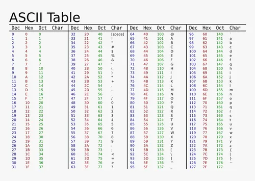

# Mastering Our Terminal

Serial line <-> Terminal <-> Keyboard / Screen

Discuss commands, escaped sequences in byte stream.

Include kprintf to see the bytes, rather than the echoed characters.

Console:
- clear screen
- cursor at (set/get)
- relative cursor moves
- colors
- cursor hide/show
- 

Game screen or console? 
Both? Probably.

Console: like a shell
- a prompt, a '$' at first
- having the ability to read a line, edited, is a nice functionality.
- up/down arrows -> history, so decode up/down arrow
- manage a cursor position, so decode left/right arrow
- backspace? 
- delete?

Game screen:
- clear screen
- manage a cursor position
- hence must decode arrows and 'enter'
- programmatically move the cursor (row,col)

Will need to discuss kprintf.

Redirect printf to a lower part of the screen?
Split screen, "canvas above", "text below".

Events? Before interrupts?

================================================================
# Mastering Our Terminal

Our software runs in the illusion of a Versatile Board, connected
to a terminal, connected through the serial line that is plugged 
to the UART0.

## Terminal Discovery

A terminal has a keyboard and a screen. 
- Reading from the UART0, you receive bytes sent by the keyboard. 
- Writing to the UART0, you are sending bytes to the screen.

These bytes are an encoding for characters and commands:
- characters are ASCII-encoded
- commands are encoded with the prefix "ESC[" 
  which is the byte sequence: 27,91

For fun, in a regular shell terminal, under Linux, you can try the following:

    $ clear ; echo -e "\033[10;20HHello"

    $ echo -e "\033[H\033[2J"

Nota Bene: "\033[" is the byte sequence 27,91

The terminal supports colors, foreground and background colors:

    $ echo -e "\033[31m"

    $ echo -e "\033[47m"

    $ echo -e "\033[0m"

You can try also to make the cursor disappear:

    $ echo -e "\033[?25l"

Oops, to get it back, the simpler is to type `reset`, like this:

    $ reset

OK, enough simple fun, let's get back to our project and 
using our terminal, from our code running on the Versatile Board.

First, let's convince ourselves that we do have a 
terminal with no echo, that the echo comes from our code.
Change the code in the function `_start` to stop writing
in the UART0. 
> commenting send
What do you see? Nothing, right?
None of the typed keys on the keyboard echoes on the terminal.

Second, let's now convince ourselves that we have bytes flowing
through the serial line, ASCII-encoded characters or commands.

How are we going to do that? 

We going to print the bytes, as integer values.

But how? If only we had a `printf`...

But we do, so let's add the file `kprintf.c` to the compiled and linked sources in our makefile. Done? Great.

Modify the code of the function `_start` like this:

```c
  while (1) {
    uint8_t c;
    if (0==uart_receive(UART0,&c))
      continue;
    kprintf("%d ",c);
  }
```
Now `make run`, type different letter keys on the keyboard, look at the ASCII table
and locate the printed ASCII codes that they corresponds to the typed letters.



By the way, how come the function `kprintf` prints to the terminal? 
It must send bytes through the UART0, right?
Well, have a look at the source `kprintf.c`, just the first 65 lines.

What did you see? Indeed, the function `kprintf` uses the function `kputchar` that in turns sends the given code through the UART0.

Now, type on the keyboard the arrow keys... what happens? 

Indeed, each key stroke is now sending multiple bytes. In fact, they are control sequences:

    up:	   27,91,65
    down:  27,91,66
    right: 27,91,67
    left:  27,91,68

Try the 'delete' key:

    del:   27,91,51,126

If you were to send these sequences to the terminal, the terminal would react as if the corresponding keys had been stoke on the keyboard. 

So that is interesting, let's try to control our terminal programmatically.

## Control Sequences

So what can we control?
  
- clear screen: 27 91 'H' 27 91 '2' 'J'  
- cursor hide: 27 91 '?' '2' '5' 'l'
- cursor show: 27 91 '?' '2' '5' 'h'

We can control the cursor position,
knowing that the terminal is a grid of characters,
rows being horizontal and columns vertical. 

    [1,NROWS] [1,NCOLS]

**Nota Bene:** you must choose values for the ncols and nrows
that match your Linux terminal window size. You can normally
see that in the window's menus. A typical size is 80x24 or
80x43 in the (ncols,nrows) format.

<span style="color:red">Important:</span> some terminal emulation
emulate a wrap-around policy at the end of a line rather than blocking
the cursor. If it is the case, we suggest that you use a smaller
ncols, like 79 instead of 80, to avoid this wrapping-around policy.

- cursor at (int row, int col): 27 91 row ';' col 'H'

With the row and column numbers starting at 1, not 0.
Also, the row and column numbers appear as single digit
or multiple digits, like "2", "12", but not like "04"
(no preceding zeroes).

The following cursor commands may work for you:

- ESC[nA  # cursor up n rows
- ESC[nB  # cursor down n rows
- ESC[nC  # cursor forward n columns
- ESC[nD  # cursor back n columns
- ESC[s   # save cursor position
- ESC[u   # restore cursor position

with ESC=27=\033, the escape code.

Also, we can control colors, both the ink color or the background color.

- reset color: 27 91 '0' 'm'
- set color (c=2 digits): 27 91 c 'm'

There are constants for the different colors. 
Some of the constants will set the ink color, also called the foreground color.
Some other constants will set the background color.  

## Implement the Console

OK, so let's create some basic support for a console.
You have been given the header file `console.h`, you need
to create the source file `console.c`.

Time to do the implementation of the functions declared 
in `console.h` in the file `console.c`.

Do not forget to include in the makefile the code of your console
so that it is compiled. 

Also, do not forget to check the total size required by the generated
code (not the ELF but the binary) so that you can adapt the amount of
memory emulated by from QEMU.

Finally, do not forget to initialize the console and use the console 
to echo typed characters, something like this:

  ```c
  void _start() {
    console_init();
    while (1) {
      uint8_t c;
      if (0==uart_receive(UART0,&c))
        continue;
      console_echo(c);
    }
  }
  ```
<span style="color:red">IMPORTANT:</span> do not forget to maintain
the cursor position in software and it must be kept in sync with 
the cursor managed in hardware by the terminal. 

## Our First Test

**Do not use yet the console callback, provide a function that does nothing.**

- clear the screen and position the cursor at (0,0).
- drive the cursor around using the arrow keys
- the cursor must never leave the screen, blocking it
  when reaching an edge. Do NOT USE the last column
  of the hardware terminal, see comment earlier about
  the auto-wrap support in some terminal emulation, 
  which is a bug in the emulation. The `gnome terminal`
  has the bug.

## Our Second test

**Do not use yet the console callback, provide a function that does nothing.**

- hide the terminal blinking cursor.
- let's make our own blinking cursor with '_' 
  or pick a shape from the extended ASCII encoding
  or even more fun do a rotating star, 
  using the following sequence of characters:

     char chars[8]= { '|', '/', '-', '\\', '|', '/', '-', '\\', };

- make the shape blink every 500ms, cycling between red/white
  for the ink color.

## Our Third test -- Da Vinci

This test will use the console callback, encrypting à la Da Vinci, each line
entered on the keyboard.

The line callback is one feature of the console that we did not discuss in details so far.

In the header file `console.h`, the specification says:

```c
/*
 * Initializes the console, giving the callback
 * to call for each line entered on the keyboard.
 * A line is a C string but contains only ASCII 
 * characters ([32-126]), as a C string it is 
 * terminated by a '\0'.
 * A line is validated by the end user by hitting 
 * the key `Enter`.
 */
void console_init(void (*callback)(char*));
```

What the specification does not say is that the console must save the cursor 
position before calling back the given callback function and restore it just 
after.

This enables the callback to use the console from the callback, it can move the cursor around and send characters to the UART0 via `uart_send` or `kprintf`.

So now, write the Da Vinci callback that rewrites the entered line by inverting the orders of the characters:

  Hello -> olleH
  Great! -> !taerG
  Abba   -> abbA

Have fun...

