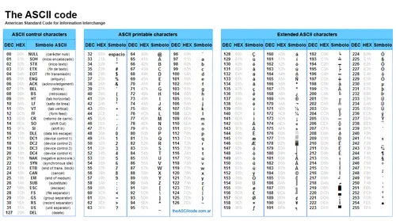

# Understanding the execution

We are concerned here about the "execution part" of the makefile.
Look at the targets `run` and `debug`.

- The target `run` is for launching QEMU, loading our code, and executing it.
- The target `debug` is for launching QEMU but allow us to debug. 

**Make sure you understand these two targets and what is going on under the hood.**

## QEMU Arguments

This section is explaining the arguments given to QEMU.

## Debugging with QEMU

QEMU loads our code but suspends its execution before executing any instruction and waits for the debugger `gdb` to connect. 

Launch a debug session using two Linux terminal:
- one terminal is used to launch QEMU
- the other terminal is used to launch GDB

Using `gdb`, you can single step through C code and assembly code.
Look at the [gdb cheat sheet](./gdb.md) if you need a gdb refresher.

# Understanding the code

Under debugger, follow the execution, stepping through the entire code.

- Make sure you know how to use the GNU debugger properly
- Make sure you understand the code that executes

## Boot sequence

**Question:** did you understand the exception vector?

**Question:** did you understand the BSS section initialization?

**Question:** did you understand why there is a stack and where it is and
how it grows?

## Main loop

Please look at the main loop in the C function `_start`.

Let's consider the two behaviors, based on the define `ECHO_ZZZ`.
Look at the top of the file `main.c` to find where the definition
of `ECHO_ZZZ`.

Let's start with `ECHO_ZZZ` as **undefined**.
```c 
#undef ECHO_ZZZ
```

```c
 while (1) {
    uint8_t c;
    if (0==uart_receive(UART0,&c))
      continue;
    if (c == 13) {
      uart_send(UART0, '\r');
      uart_send(UART0, '\n');
    } else {
      uart_send(UART0, c);
    }
  }
```

Not looking at the implementation in the source file `uart.c`,
but looking at the header file `uart.h`, let's explain this loop.

**Question:** explain the above loop.

**Question:** what are the bytes flowing back and forth through the UART0? 

Let's continue with `ECHO_ZZZ` as **defined**.
```c 
#define ECHO_ZZZ
```

```c
 while (1) {
    uint8_t c;
    while (0 == uart_receive(UART0, &c)) {
      count++;
      if (count > 50000000) {
        uart_send_string(UART0, "\n\rZzzz....\n\r");
        count = 0;
      }
    }
    if (c == 13) {
      uart_send(UART0, '\r');
      uart_send(UART0, '\n');
    } else {
      uart_send(UART0, c);
    }
  }
```

**Question:** what is the printing of "Zzzz...." telling you? 

# Discussing Serial Lines

Let's come back to one of our previous questions:

    what are the bytes flowing back and forth through the UART0? 

Looking at the function declarations:

```c
/*
 * Receive a byte from the given uart, this is a non-blocking call.
 * Returns 0 if there are no byte available.
 * Returns 1 if a character was read.
 */
int uart_receive(void* uart, uint8_t *b);

/*
 * Sends a byte through the given uart, this is a blocking call.
 * The code spins until there is room in the UART TX FIFO queue 
 * to send the given byte.
 */
void uart_send(void* uart, uint8_t b);

```
We can clearly see that the bytes are flowing through the UART0.
So this is OK if the character encoding is ASCII.




You can find some more explanation 
[here in french](https://www.ascii-code.com/fr)
and [here in english](https://en.wikipedia.org/wiki/ASCII).
